# Visual Architecture Documentation

## 1. System Architecture Overview

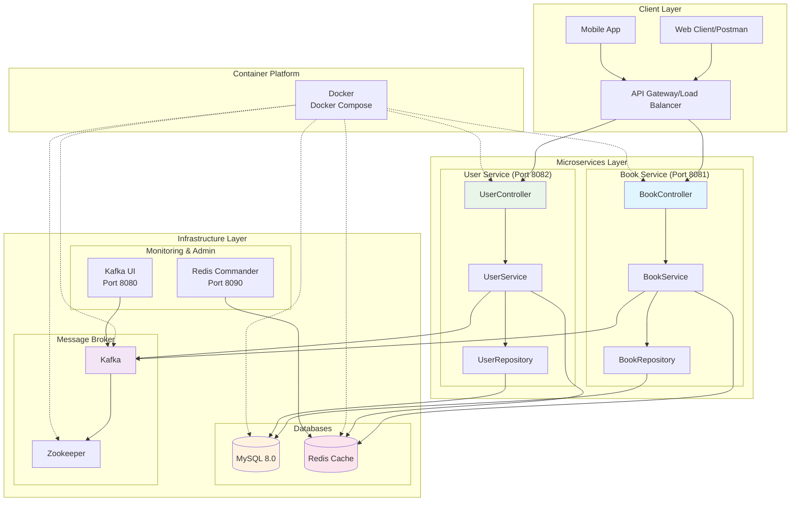

## 2. Data Flow Architecture

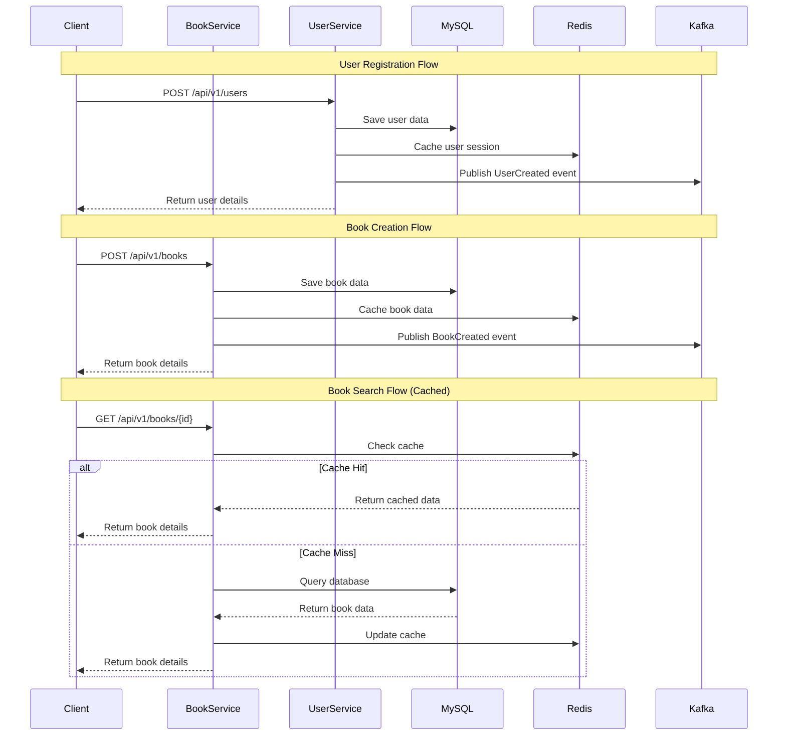

## 3. Container Architecture

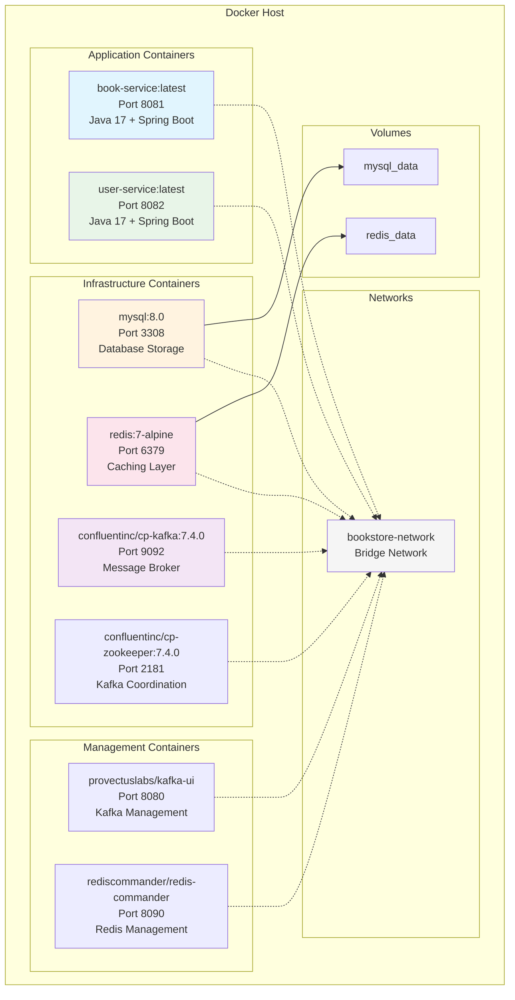

## 4. Book Service - UML Class Diagram

```mermaid
classDiagram
    class BookServiceApplication {
        +main(String[] args)
    }
    
    class BookController {
        -BookService bookService
        +getAllBooks(page, size) ResponseEntity~List~BookDto~~
        +getBookById(id) ResponseEntity~BookDto~
        +createBook(request) ResponseEntity~BookDto~
        +updateBook(id, request) ResponseEntity~BookDto~
        +deleteBook(id) ResponseEntity~Void~
        +searchBooks(criteria) ResponseEntity~List~BookDto~~
        +getBooksInBatch(ids) ResponseEntity~List~BookDto~~
    }
    
    class BookService {
        <<interface>>
        +getAllBooks(page, size) List~BookDto~
        +getBookById(id) BookDto
        +createBook(request) BookDto
        +updateBook(id, request) BookDto
        +deleteBook(id) void
        +searchBooks(criteria) List~BookDto~
        +getBooksInBatch(ids) List~BookDto~
    }
    
    class BookServiceImpl {
        -BookRepository bookRepository
        -RedisTemplate redisTemplate
        -KafkaProducerService kafkaProducerService
        -IdempotencyService idempotencyService
        +getAllBooks(page, size) List~BookDto~
        +getBookById(id) BookDto
        +createBook(request) BookDto
        +updateBook(id, request) BookDto
        +deleteBook(id) void
        -validateBookData(book) void
        -publishBookEvent(event) void
    }
    
    class BookRepository {
        <<interface>>
        +findById(id) Optional~Book~
        +findAll(pageable) Page~Book~
        +findByTitleContainingIgnoreCase(title) List~Book~
        +findByAuthorContainingIgnoreCase(author) List~Book~
        +findByCategoryAndAvailableTrue(category) List~Book~
        +findByIsbn(isbn) Optional~Book~
        +updateStockById(id, stock) int
    }
    
    class Book {
        -Long id
        -String title
        -String author
        -String isbn
        -String category
        -BigDecimal price
        -Integer stock
        -String description
        -Boolean available
        -LocalDateTime createdAt
        -LocalDateTime updatedAt
        +getId() Long
        +setId(Long) void
        +getTitle() String
        +setTitle(String) void
        +equals(Object) boolean
        +hashCode() int
        +toString() String
    }
    
    class BookDto {
        -Long id
        -String title
        -String author
        -String isbn
        -String category
        -BigDecimal price
        -Integer stock
        -String description
        -Boolean available
        -LocalDateTime createdAt
        -LocalDateTime updatedAt
    }
    
    class CreateBookRequestDto {
        -String title
        -String author
        -String isbn
        -String category
        -BigDecimal price
        -Integer stock
        -String description
    }
    
    class UpdateBookRequestDto {
        -String title
        -String author
        -String category
        -BigDecimal price
        -Integer stock
        -String description
        -Boolean available
    }
    
    class BookEvent {
        -String eventType
        -Long bookId
        -BookDto bookData
        -LocalDateTime timestamp
        -String correlationId
    }
    
    class KafkaProducerService {
        -KafkaTemplate kafkaTemplate
        +publishBookEvent(event) void
        +publishBookCreated(bookId) void
        +publishBookUpdated(bookId) void
        +publishBookDeleted(bookId) void
    }
    
    class IdempotencyService {
        -RedisTemplate redisTemplate
        +isOperationProcessed(key) boolean
        +markOperationAsProcessed(key) void
        +generateIdempotencyKey(operation, params) String
    }
    
    class GlobalExceptionHandler {
        +handleBookNotFound(ex) ResponseEntity~ErrorResponse~
        +handleDuplicateIsbn(ex) ResponseEntity~ErrorResponse~
        +handleValidationException(ex) ResponseEntity~ErrorResponse~
        +handleGenericException(ex) ResponseEntity~ErrorResponse~
    }
    
    class RedisConfig {
        +redisTemplate() RedisTemplate
        +cacheManager() CacheManager
    }
    
    class KafkaConfig {
        +kafkaTemplate() KafkaTemplate
        +producerFactory() ProducerFactory
    }
    
    %% Relationships
    BookController --> BookService : uses
    BookServiceImpl ..|> BookService : implements
    BookServiceImpl --> BookRepository : uses
    BookServiceImpl --> KafkaProducerService : uses
    BookServiceImpl --> IdempotencyService : uses
    BookRepository --> Book : manages
    BookServiceImpl --> BookDto : creates
    BookController --> CreateBookRequestDto : receives
    BookController --> UpdateBookRequestDto : receives
    BookController --> BookDto : returns
    KafkaProducerService --> BookEvent : publishes
    BookServiceImpl --> Book : works with
    
    %% Styling
    class BookController {
        <<@RestController>>
    }
    class BookServiceImpl {
        <<@Service>>
    }
    class BookRepository {
        <<@Repository>>
    }
    class Book {
        <<@Entity>>
    }
    class RedisConfig {
        <<@Configuration>>
    }
    class KafkaConfig {
        <<@Configuration>>
    }
```

## 5. User Service - UML Class Diagram

```mermaid
classDiagram
    class UserServiceApplication {
        +main(String[] args)
    }
    
    class UserController {
        -UserService userService
        +getAllUsers(page, size) ResponseEntity~List~UserDto~~
        +getUserById(id) ResponseEntity~UserDto~
        +createUser(request) ResponseEntity~UserDto~
        +updateUser(id, request) ResponseEntity~UserDto~
        +deleteUser(id) ResponseEntity~Void~
        +searchUsers(criteria) ResponseEntity~List~UserDto~~
        +getUsersInBatch(ids) ResponseEntity~List~UserDto~~
    }
    
    class UserService {
        <<interface>>
        +getAllUsers(page, size) List~UserDto~
        +getUserById(id) UserDto
        +createUser(request) UserDto
        +updateUser(id, request) UserDto
        +deleteUser(id) void
        +searchUsers(criteria) List~UserDto~
        +getUsersInBatch(ids) List~UserDto~
    }
    
    class UserServiceImpl {
        -UserRepository userRepository
        -RedisTemplate redisTemplate
        -KafkaProducerService kafkaProducerService
        -IdempotencyService idempotencyService
        -PasswordEncoder passwordEncoder
        +getAllUsers(page, size) List~UserDto~
        +getUserById(id) UserDto
        +createUser(request) UserDto
        +updateUser(id, request) UserDto
        +deleteUser(id) void
        -validateUserData(user) void
        -encryptSensitiveData(user) void
        -publishUserEvent(event) void
    }
    
    class UserRepository {
        <<interface>>
        +findById(id) Optional~User~
        +findAll(pageable) Page~User~
        +findByEmail(email) Optional~User~
        +findByUsername(username) Optional~User~
        +findByPhoneNumber(phone) Optional~User~
        +findByActiveTrue() List~User~
        +updateLastLoginById(id, timestamp) int
    }
    
    class User {
        -Long id
        -String username
        -String email
        -String encryptedPassword
        -String firstName
        -String lastName
        -String phoneNumber
        -LocalDate dateOfBirth
        -String address
        -String city
        -String country
        -String postalCode
        -Boolean active
        -LocalDateTime createdAt
        -LocalDateTime updatedAt
        -LocalDateTime lastLogin
        +getId() Long
        +setId(Long) void
        +getUsername() String
        +setUsername(String) void
        +equals(Object) boolean
        +hashCode() int
        +toString() String
    }
    
    class UserDto {
        -Long id
        -String username
        -String email
        -String firstName
        -String lastName
        -String phoneNumber
        -LocalDate dateOfBirth
        -String address
        -String city
        -String country
        -String postalCode
        -Boolean active
        -LocalDateTime createdAt
        -LocalDateTime updatedAt
        -LocalDateTime lastLogin
    }
    
    class CreateUserRequestDto {
        -String username
        -String email
        -String password
        -String firstName
        -String lastName
        -String phoneNumber
        -LocalDate dateOfBirth
        -String address
        -String city
        -String country
        -String postalCode
    }
    
    class UpdateUserRequestDto {
        -String email
        -String firstName
        -String lastName
        -String phoneNumber
        -LocalDate dateOfBirth
        -String address
        -String city
        -String country
        -String postalCode
        -Boolean active
    }
    
    class UserEvent {
        -String eventType
        -Long userId
        -UserDto userData
        -LocalDateTime timestamp
        -String correlationId
    }
    
    class UserMapper {
        +toDto(user) UserDto
        +toEntity(dto) User
        +toEntity(request) User
        +updateEntityFromDto(dto, entity) void
    }
    
    class KafkaProducerService {
        -KafkaTemplate kafkaTemplate
        +publishUserEvent(event) void
        +publishUserCreated(userId) void
        +publishUserUpdated(userId) void
        +publishUserDeleted(userId) void
    }
    
    class IdempotencyService {
        -RedisTemplate redisTemplate
        +isOperationProcessed(key) boolean
        +markOperationAsProcessed(key) void
        +generateIdempotencyKey(operation, params) String
    }
    
    class PhoneNumberConverter {
        +convertToDatabaseColumn(phone) String
        +convertToEntityAttribute(dbData) String
        -encryptPhoneNumber(phone) String
        -decryptPhoneNumber(encrypted) String
    }
    
    class GlobalExceptionHandler {
        +handleUserNotFound(ex) ResponseEntity~ErrorResponse~
        +handleDuplicateEmail(ex) ResponseEntity~ErrorResponse~
        +handleDuplicatePhone(ex) ResponseEntity~ErrorResponse~
        +handleValidationException(ex) ResponseEntity~ErrorResponse~
        +handleGenericException(ex) ResponseEntity~ErrorResponse~
    }
    
    class EncryptionConfig {
        +passwordEncoder() PasswordEncoder
        +aesUtil() AESUtil
    }
    
    class RedisConfig {
        +redisTemplate() RedisTemplate
        +cacheManager() CacheManager
    }
    
    class KafkaConfig {
        +kafkaTemplate() KafkaTemplate
        +producerFactory() ProducerFactory
    }
    
    %% Relationships
    UserController --> UserService : uses
    UserServiceImpl ..|> UserService : implements
    UserServiceImpl --> UserRepository : uses
    UserServiceImpl --> KafkaProducerService : uses
    UserServiceImpl --> IdempotencyService : uses
    UserServiceImpl --> UserMapper : uses
    UserRepository --> User : manages
    UserServiceImpl --> UserDto : creates
    UserController --> CreateUserRequestDto : receives
    UserController --> UpdateUserRequestDto : receives
    UserController --> UserDto : returns
    KafkaProducerService --> UserEvent : publishes
    UserServiceImpl --> User : works with
    User --> PhoneNumberConverter : uses
    UserMapper --> User : maps
    UserMapper --> UserDto : maps
    
    %% Styling
    class UserController {
        <<@RestController>>
    }
    class UserServiceImpl {
        <<@Service>>
    }
    class UserRepository {
        <<@Repository>>
    }
    class User {
        <<@Entity>>
    }
    class PhoneNumberConverter {
        <<@Converter>>
    }
    class EncryptionConfig {
        <<@Configuration>>
    }
    class RedisConfig {
        <<@Configuration>>
    }
    class KafkaConfig {
        <<@Configuration>>
    }
```

## 6. Database Schema Diagram

```mermaid
erDiagram
    BOOKS {
        bigint id PK "AUTO_INCREMENT"
        varchar(255) title "NOT NULL"
        varchar(255) author "NOT NULL"
        varchar(20) isbn "UNIQUE NOT NULL"
        varchar(100) category
        decimal(10,2) price "NOT NULL"
        int stock "DEFAULT 0"
        text description
        boolean available "DEFAULT true"
        timestamp created_at "DEFAULT CURRENT_TIMESTAMP"
        timestamp updated_at "DEFAULT CURRENT_TIMESTAMP ON UPDATE CURRENT_TIMESTAMP"
    }
    
    USERS {
        bigint id PK "AUTO_INCREMENT"
        varchar(50) username "UNIQUE NOT NULL"
        varchar(255) email "UNIQUE NOT NULL"
        varchar(255) encrypted_password "NOT NULL"
        varchar(100) first_name
        varchar(100) last_name
        varchar(20) phone_number "UNIQUE"
        date date_of_birth
        text address
        varchar(100) city
        varchar(100) country
        varchar(20) postal_code
        boolean active "DEFAULT true"
        timestamp created_at "DEFAULT CURRENT_TIMESTAMP"
        timestamp updated_at "DEFAULT CURRENT_TIMESTAMP ON UPDATE CURRENT_TIMESTAMP"
        timestamp last_login
    }
    
    %% Indexes
    BOOKS }|--|| IDX_BOOK_ISBN : "UNIQUE INDEX"
    BOOKS }|--|| IDX_BOOK_TITLE : "INDEX"
    BOOKS }|--|| IDX_BOOK_AUTHOR : "INDEX"
    BOOKS }|--|| IDX_BOOK_CATEGORY : "INDEX"
    
    USERS }|--|| IDX_USER_EMAIL : "UNIQUE INDEX"
    USERS }|--|| IDX_USER_USERNAME : "UNIQUE INDEX"
    USERS }|--|| IDX_USER_ACTIVE : "INDEX"
    USERS }|--|| IDX_USER_CREATED_AT : "INDEX"
```

## 7. Kafka Event Flow

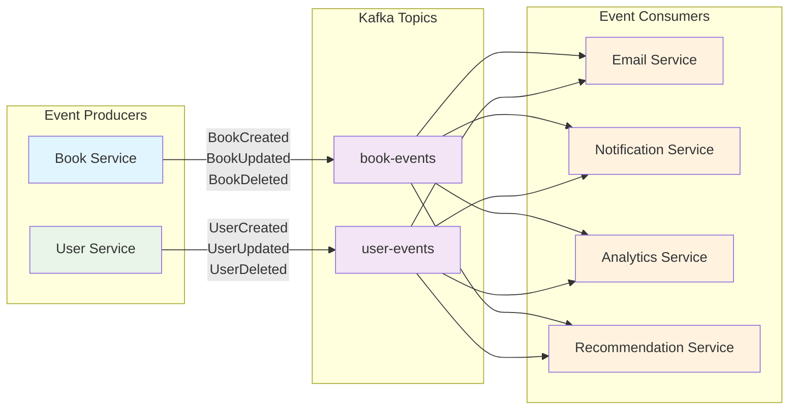

## 8. Redis Caching Strategy

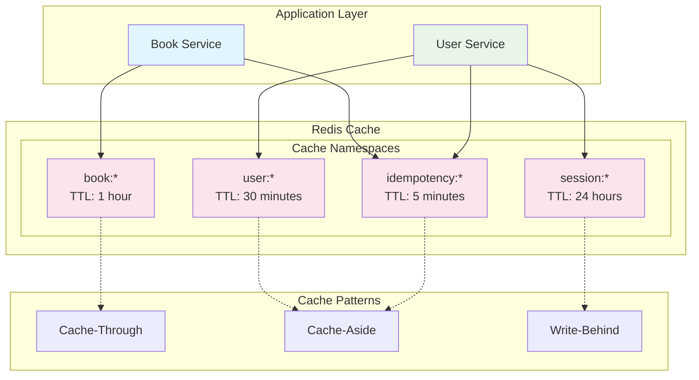

## 9. Deployment Flow

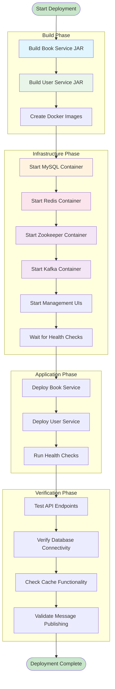

## 10. API Endpoint Overview

### Book Service Endpoints (Port 8081)

| Method | Endpoint | Description |
|--------|----------|-------------|
| GET | `/api/v1/books` | Get all books (paginated) |
| GET | `/api/v1/books/{id}` | Get book by ID |
| POST | `/api/v1/books` | Create new book |
| PUT | `/api/v1/books/{id}` | Update book |
| DELETE | `/api/v1/books/{id}` | Delete book |
| GET | `/api/v1/books/search` | Search books |
| POST | `/api/v1/books/batch` | Get books in batch |
| GET | `/api/v1/actuator/health` | Health check |
| GET | `/api/v1/swagger-ui.html` | API documentation |

### User Service Endpoints (Port 8082)

| Method | Endpoint | Description |
|--------|----------|-------------|
| GET | `/api/v1/users` | Get all users (paginated) |
| GET | `/api/v1/users/{id}` | Get user by ID |
| POST | `/api/v1/users` | Create new user |
| PUT | `/api/v1/users/{id}` | Update user |
| DELETE | `/api/v1/users/{id}` | Delete user |
| GET | `/api/v1/users/search` | Search users |
| POST | `/api/v1/users/batch` | Get users in batch |
| GET | `/api/v1/actuator/health` | Health check |
| GET | `/api/v1/swagger-ui.html` | API documentation |

## 11. Technology Stack Summary

```mermaid
graph TB
    subgraph "Application Layer"
        JAVA[Java 17]
        SB[Spring Boot 3.2]
        SW[Spring Web]
        SD[Spring Data JPA]
        SC[Spring Cache]
        SK[Spring Kafka]
    end
    
    subgraph "Database Layer"
        MYSQL[MySQL 8.0]
        REDIS[Redis 7]
        HIB[Hibernate ORM]
    end
    
    subgraph "Messaging Layer"
        KAFKA[Apache Kafka 7.4]
        ZK[Zookeeper]
    end
    
    subgraph "Container Layer"
        DOCKER[Docker]
        DC[Docker Compose]
    end
    
    subgraph "Documentation & Testing"
        SWAGGER[OpenAPI/Swagger]
        JUNIT[JUnit 5]
        MOCK[Mockito]
        TEST[TestContainers]
    end
    
    subgraph "Monitoring & Management"
        ACT[Spring Actuator]
        KUI[Kafka UI]
        RC[Redis Commander]
    end
    
    %% Dependencies
    SB --> JAVA
    SW --> SB
    SD --> SB
    SC --> SB
    SK --> SB
    HIB --> SD
    HIB --> MYSQL
    SC --> REDIS
    SK --> KAFKA
    KAFKA --> ZK
    
    style JAVA fill:#f4511e
    style SB fill:#6db33f
    style MYSQL fill:#4479a1
    style REDIS fill:#dc382d
    style KAFKA fill:#231f20
    style DOCKER fill:#2496ed
```

This comprehensive visual documentation provides:

1. **System Architecture Overview** - Complete microservices architecture
2. **Data Flow Architecture** - Sequence diagrams showing request flows
3. **Container Architecture** - Docker container relationships
4. **UML Class Diagrams** - Detailed class structures for both services
5. **Database Schema** - Entity relationship diagrams
6. **Kafka Event Flow** - Message broker event patterns
7. **Redis Caching Strategy** - Caching patterns and TTL strategies
8. **Deployment Flow** - Step-by-step deployment process
9. **API Endpoint Overview** - Complete REST API reference
10. **Technology Stack Summary** - All technologies and their relationships

These diagrams will help you understand the complete architecture and explain the microservices pattern effectively for learning and interviews.
    end
    
    subgraph "Microservices Layer"
        C[Book Service :8081]
        D[User Service :8082]
    end
    
    subgraph "Data Layer"
        E[(Books Database)]
        F[(Users Database)]
    end
    
    subgraph "Infrastructure Layer"
        G[Redis Cache]
        H[Kafka Message Broker]
        I[Zookeeper]
        J[Prometheus]
        K[Grafana]
        L[SonarQube]
    end
    
    A --> B
    B --> C
    B --> D
    C --> E
    D --> F
    C --> G
    D --> G
    C --> H
    D --> H
    H --> I
    C --> J
    D --> J
    J --> K
```

## Database ER Diagrams

### Books Database Schema
```mermaid
erDiagram
    BOOKS {
        bigint id PK
        varchar(255) title
        varchar(255) author
        varchar(20) isbn UK
        decimal(10,2) price
        int stock_quantity
        text description
        varchar(100) category
        datetime created_at
        datetime updated_at
        boolean active
    }
```

### Users Database Schema
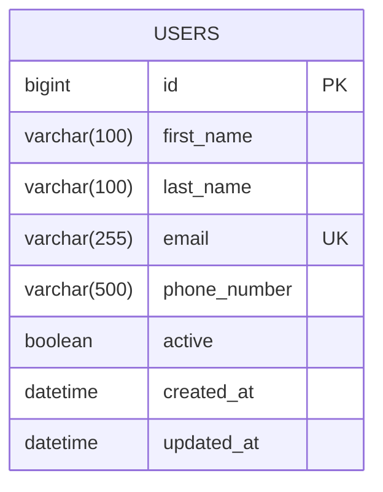

## API Flow Diagrams

### Book Creation Flow
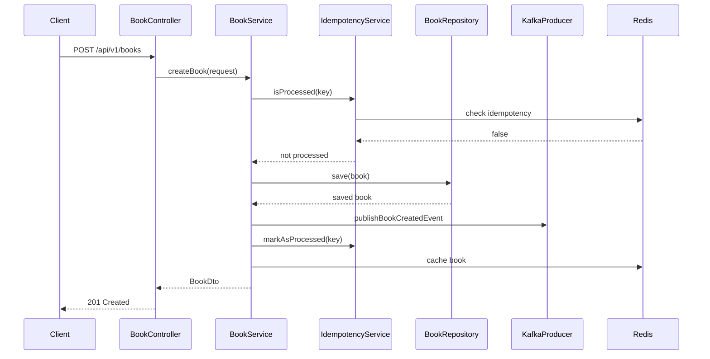

### User Registration Flow
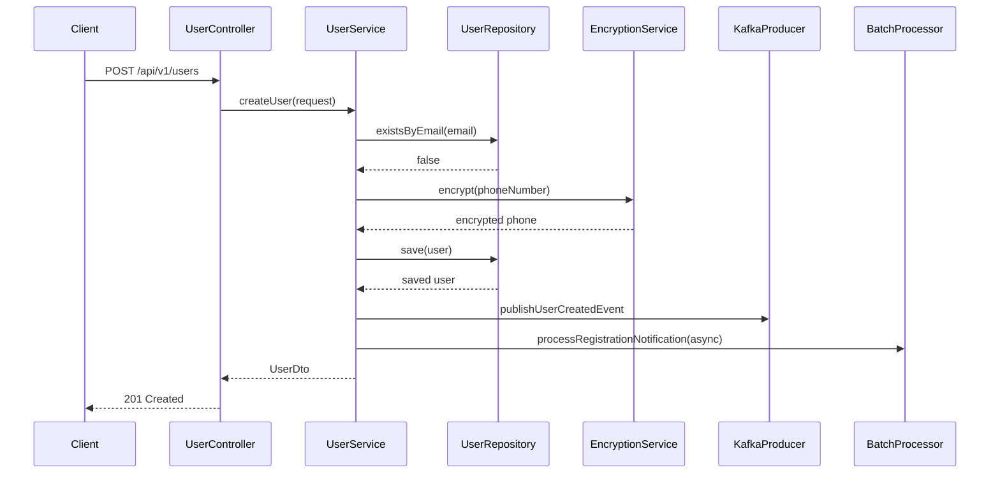

## Microservices Communication Flow

### Service-to-Service Communication
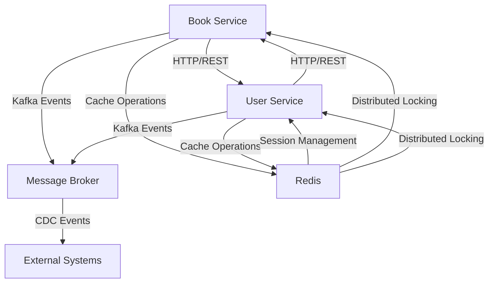

### Circuit Breaker Pattern Flow
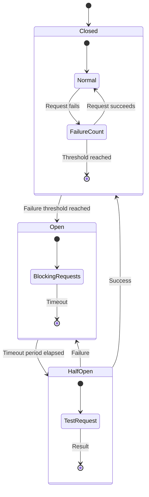

## Kafka Event Flow

### Event-Driven Architecture
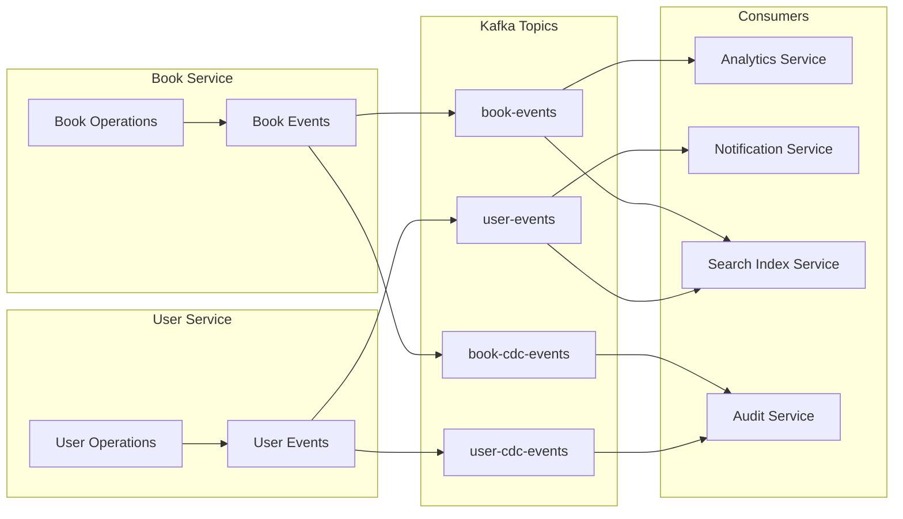

### CDC (Change Data Capture) Flow
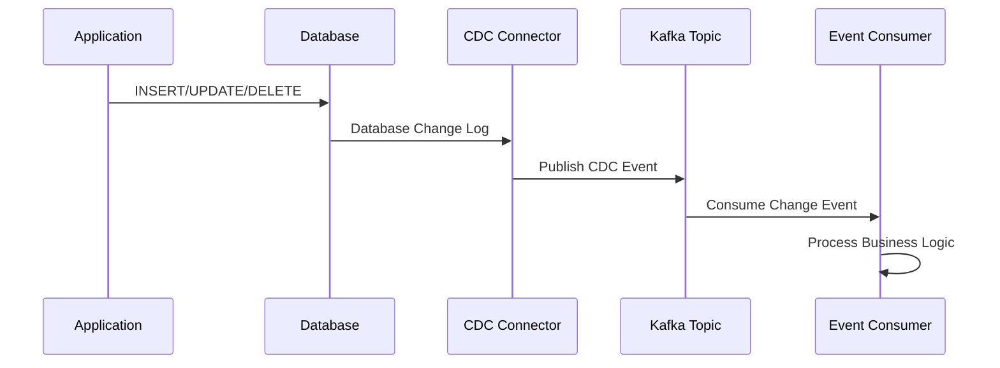

## Redis Caching Strategy

### Multi-Level Caching
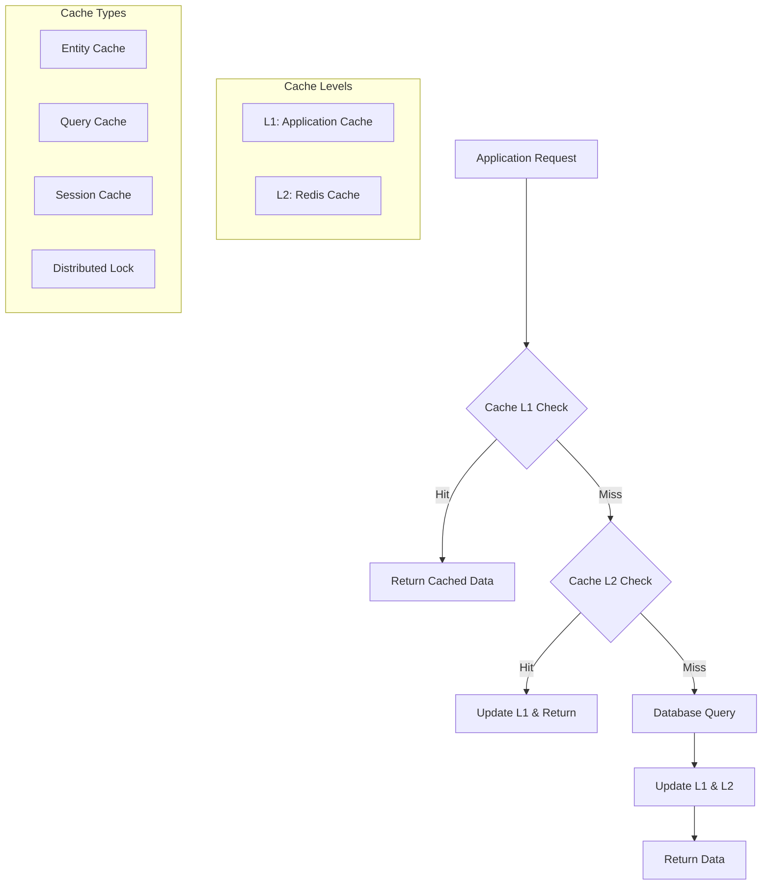

### Cache Invalidation Strategy
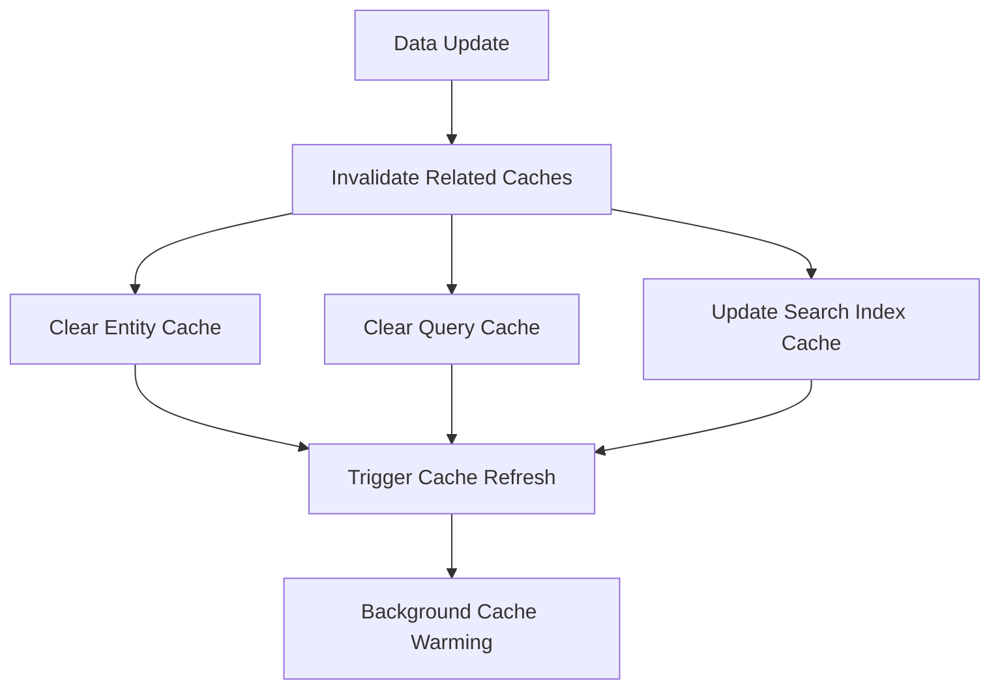

## Mind Maps

### Spring Boot Learning Mind Map
```
Spring Boot Interview Prep
├── Core Concepts
│   ├── Dependency Injection
│   ├── Auto-Configuration
│   ├── Starter Dependencies
│   └── Application Properties
├── Data Access
│   ├── Spring Data JPA
│   ├── Hibernate ORM
│   ├── Database Migrations (Liquibase)
│   └── Connection Pooling
├── Caching
│   ├── Redis Integration
│   ├── Cache Abstraction
│   ├── Cache Strategies
│   └── Distributed Caching
├── Messaging
│   ├── Kafka Producer/Consumer
│   ├── Event-Driven Architecture
│   ├── Message Serialization
│   └── Error Handling
├── Security
│   ├── Data Encryption
│   ├── Input Validation
│   ├── Authentication/Authorization
│   └── Security Headers
├── Testing
│   ├── Unit Testing (JUnit)
│   ├── Integration Testing
│   ├── Contract Testing
│   └── Test Containers
├── Monitoring
│   ├── Actuator Endpoints
│   ├── Metrics (Prometheus)
│   ├── Health Checks
│   └── Distributed Tracing
└── Design Patterns
    ├── Repository Pattern
    ├── Service Layer Pattern
    ├── Circuit Breaker
    └── Idempotency Pattern
```

### Microservices Architecture Mind Map
```
Microservices Architecture
├── Service Design
│   ├── Single Responsibility
│   ├── Domain-Driven Design
│   ├── API First Approach
│   └── Database per Service
├── Communication
│   ├── Synchronous (REST/HTTP)
│   ├── Asynchronous (Messaging)
│   ├── Service Discovery
│   └── Load Balancing
├── Data Management
│   ├── Event Sourcing
│   ├── CQRS Pattern
│   ├── Saga Pattern
│   └── Distributed Transactions
├── Resilience
│   ├── Circuit Breaker
│   ├── Retry Mechanism
│   ├── Timeout Handling
│   └── Bulkhead Pattern
├── Observability
│   ├── Logging
│   ├── Metrics
│   ├── Distributed Tracing
│   └── Health Monitoring
└── Deployment
    ├── Containerization (Docker)
    ├── Orchestration (Kubernetes)
    ├── CI/CD Pipelines
    └── Blue-Green Deployment
```

### Database Design Mind Map
```
Database Design & Optimization
├── Schema Design
│   ├── Normalization
│   ├── Denormalization
│   ├── Indexing Strategy
│   └── Partitioning
├── Performance
│   ├── Query Optimization
│   ├── Connection Pooling
│   ├── Read Replicas
│   └── Caching Layers
├── Migrations
│   ├── Version Control
│   ├── Rollback Strategies
│   ├── Zero-Downtime Deployments
│   └── Data Consistency
├── Monitoring
│   ├── Query Performance
│   ├── Connection Metrics
│   ├── Resource Utilization
│   └── Error Tracking
└── Security
    ├── Access Controls
    ├── Data Encryption
    ├── Audit Logging
    └── Backup Strategies
```

## Technology Integration Diagram

```mermaid
graph TB
    subgraph "Development Stack"
        A[Java 17] --> B[Spring Boot 3.x]
        B --> C[Spring Data JPA]
        B --> D[Spring Security]
        B --> E[Spring Cache]
        B --> F[Spring Kafka]
    end
    
    subgraph "Database Stack"
        G[MySQL 8.0] --> H[Liquibase]
        G --> I[HikariCP]
        G --> J[Hibernate]
    end
    
    subgraph "Caching Stack"
        K[Redis 7.x] --> L[Redisson]
        K --> M[Spring Session]
        K --> N[Jedis/Lettuce]
    end
    
    subgraph "Messaging Stack"
        O[Apache Kafka] --> P[Zookeeper]
        O --> Q[Schema Registry]
        O --> R[Kafka Connect]
    end
    
    subgraph "Monitoring Stack"
        S[Prometheus] --> T[Grafana]
        S --> U[Alert Manager]
        V[ELK Stack] --> W[Kibana]
    end
    
    subgraph "Quality Stack"
        X[SonarQube] --> Y[Code Quality]
        Z[JUnit 5] --> AA[Test Coverage]
        BB[Testcontainers] --> CC[Integration Tests]
    end
    
    B --> G
    B --> K
    B --> O
    B --> S
    B --> X
```

This visual documentation provides comprehensive diagrams and mind maps to help understand the system architecture, data flow, and technology stack of the Online Bookstore application.
