# Visual Documentation for Online Bookstore

This document contains flowcharts, UML diagrams, and mind maps for the Online Bookstore application.

## Table of Contents
1. [System Architecture Diagram](#system-architecture-diagram)
2. [Database ER Diagrams](#database-er-diagrams)
3. [API Flow Diagrams](#api-flow-diagrams)
4. [Microservices Communication Flow](#microservices-communication-flow)
5. [Kafka Event Flow](#kafka-event-flow)
6. [Redis Caching Strategy](#redis-caching-strategy)
7. [Mind Maps](#mind-maps)

## System Architecture Diagram

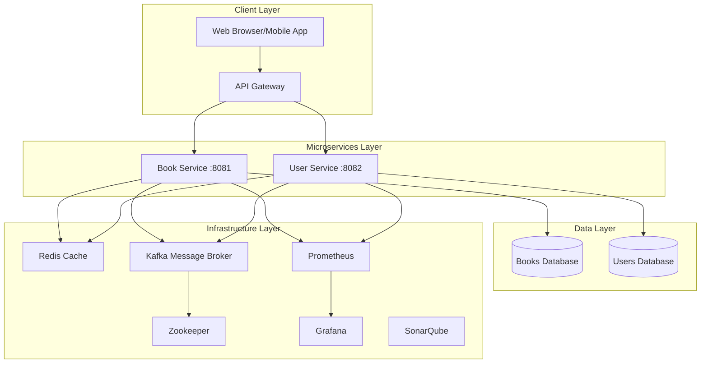

## Database ER Diagrams

### Books Database Schema
```mermaid
erDiagram
    BOOKS {
        bigint id PK
        varchar(255) title
        varchar(255) author
        varchar(20) isbn UK
        decimal(10,2) price
        int stock_quantity
        text description
        varchar(100) category
        datetime created_at
        datetime updated_at
        boolean active
    }
```

### Users Database Schema
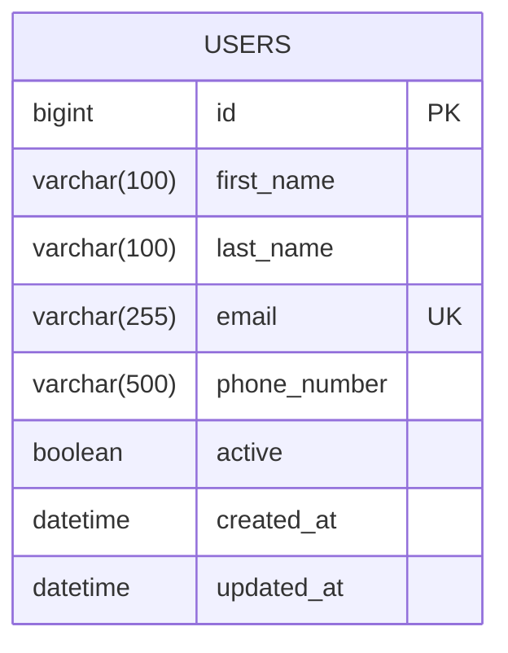

## API Flow Diagrams

### Book Creation Flow
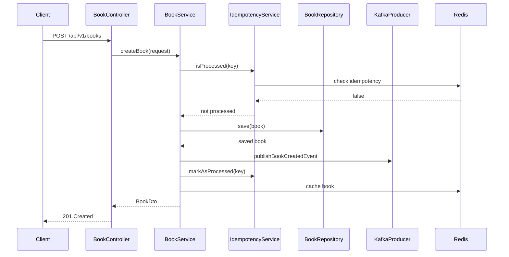

### User Registration Flow
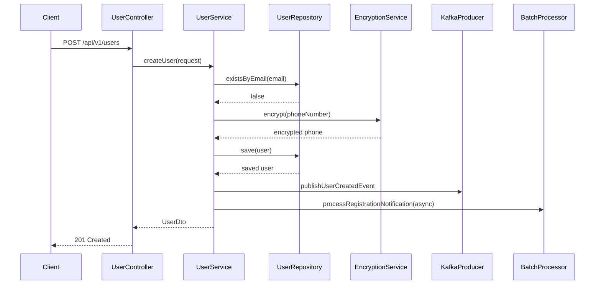

## Microservices Communication Flow

### Service-to-Service Communication
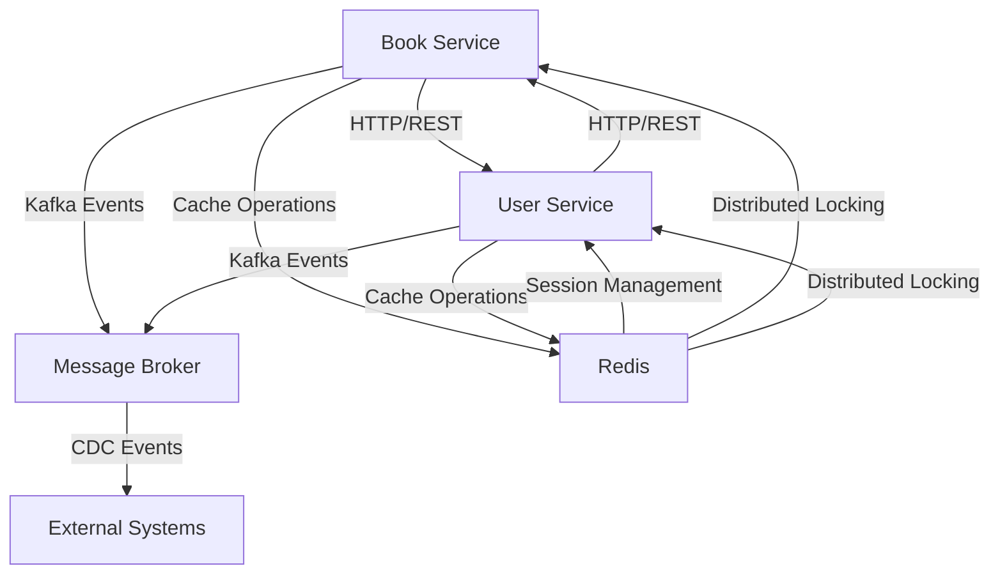

### Circuit Breaker Pattern Flow
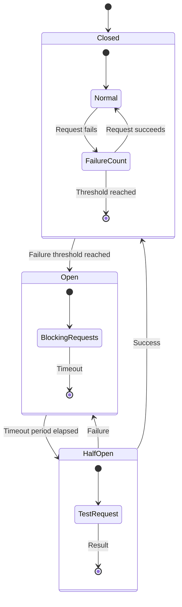

## Kafka Event Flow

### Event-Driven Architecture
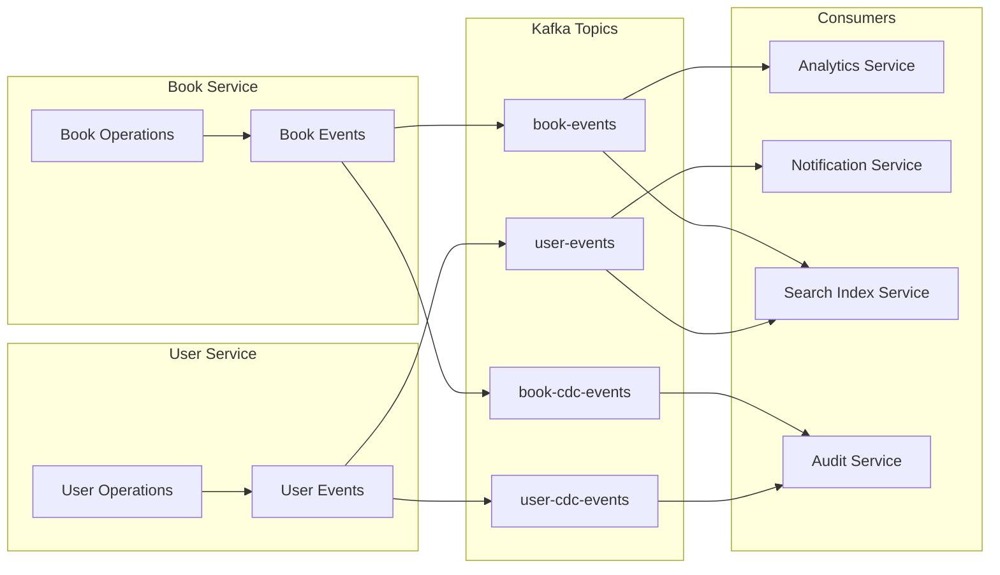

### CDC (Change Data Capture) Flow
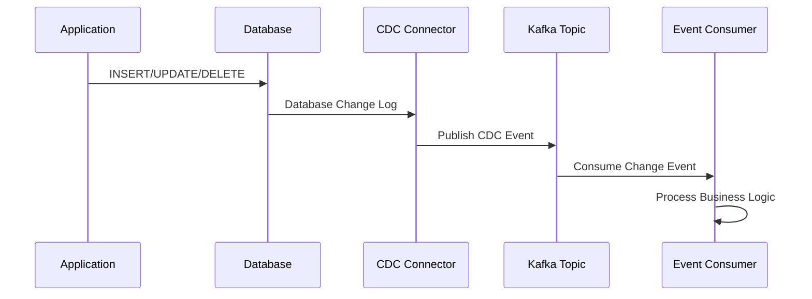

## Redis Caching Strategy

### Multi-Level Caching
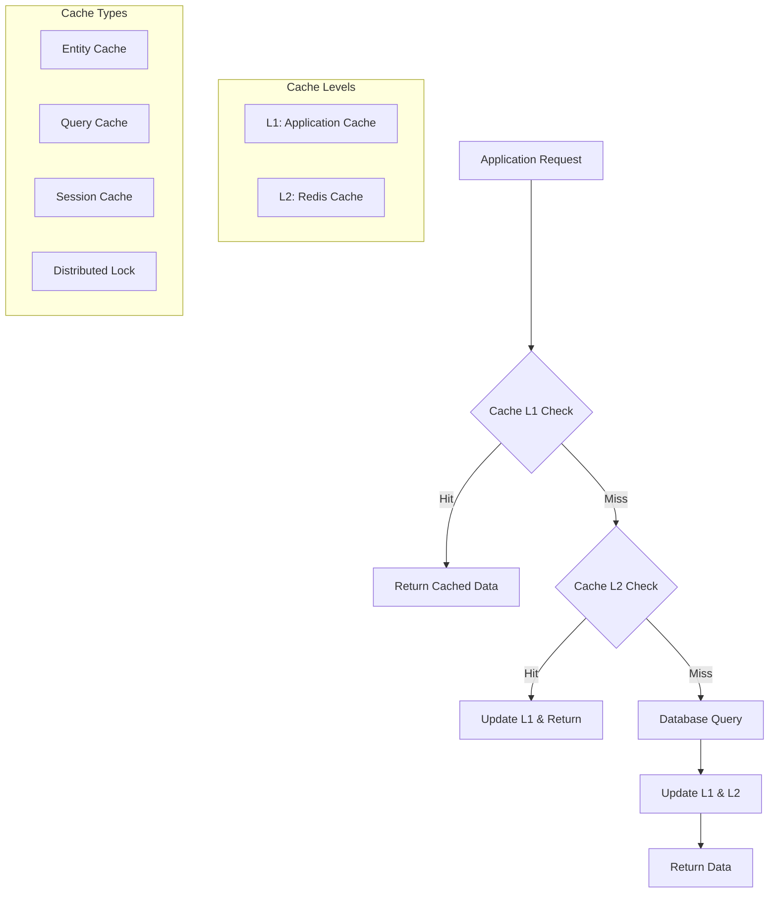

### Cache Invalidation Strategy
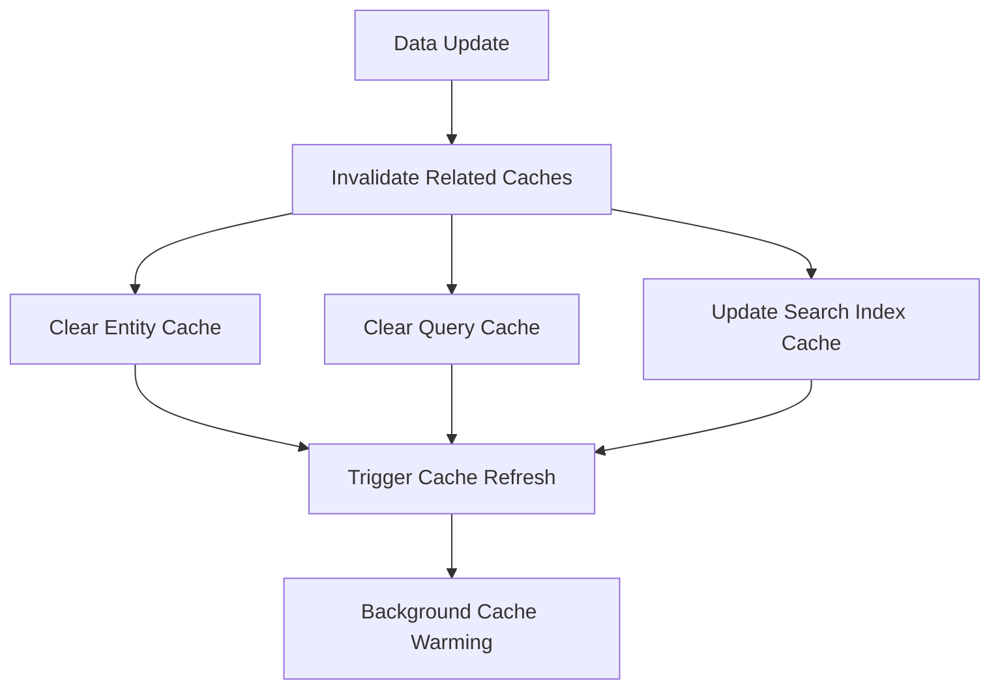

## Mind Maps

### Spring Boot Learning Mind Map
```
Spring Boot Interview Prep
├── Core Concepts
│   ├── Dependency Injection
│   ├── Auto-Configuration
│   ├── Starter Dependencies
│   └── Application Properties
├── Data Access
│   ├── Spring Data JPA
│   ├── Hibernate ORM
│   ├── Database Migrations (Liquibase)
│   └── Connection Pooling
├── Caching
│   ├── Redis Integration
│   ├── Cache Abstraction
│   ├── Cache Strategies
│   └── Distributed Caching
├── Messaging
│   ├── Kafka Producer/Consumer
│   ├── Event-Driven Architecture
│   ├── Message Serialization
│   └── Error Handling
├── Security
│   ├── Data Encryption
│   ├── Input Validation
│   ├── Authentication/Authorization
│   └── Security Headers
├── Testing
│   ├── Unit Testing (JUnit)
│   ├── Integration Testing
│   ├── Contract Testing
│   └── Test Containers
├── Monitoring
│   ├── Actuator Endpoints
│   ├── Metrics (Prometheus)
│   ├── Health Checks
│   └── Distributed Tracing
└── Design Patterns
    ├── Repository Pattern
    ├── Service Layer Pattern
    ├── Circuit Breaker
    └── Idempotency Pattern
```

### Microservices Architecture Mind Map
```
Microservices Architecture
├── Service Design
│   ├── Single Responsibility
│   ├── Domain-Driven Design
│   ├── API First Approach
│   └── Database per Service
├── Communication
│   ├── Synchronous (REST/HTTP)
│   ├── Asynchronous (Messaging)
│   ├── Service Discovery
│   └── Load Balancing
├── Data Management
│   ├── Event Sourcing
│   ├── CQRS Pattern
│   ├── Saga Pattern
│   └── Distributed Transactions
├── Resilience
│   ├── Circuit Breaker
│   ├── Retry Mechanism
│   ├── Timeout Handling
│   └── Bulkhead Pattern
├── Observability
│   ├── Logging
│   ├── Metrics
│   ├── Distributed Tracing
│   └── Health Monitoring
└── Deployment
    ├── Containerization (Docker)
    ├── Orchestration (Kubernetes)
    ├── CI/CD Pipelines
    └── Blue-Green Deployment
```

### Database Design Mind Map
```
Database Design & Optimization
├── Schema Design
│   ├── Normalization
│   ├── Denormalization
│   ├── Indexing Strategy
│   └── Partitioning
├── Performance
│   ├── Query Optimization
│   ├── Connection Pooling
│   ├── Read Replicas
│   └── Caching Layers
├── Migrations
│   ├── Version Control
│   ├── Rollback Strategies
│   ├── Zero-Downtime Deployments
│   └── Data Consistency
├── Monitoring
│   ├── Query Performance
│   ├── Connection Metrics
│   ├── Resource Utilization
│   └── Error Tracking
└── Security
    ├── Access Controls
    ├── Data Encryption
    ├── Audit Logging
    └── Backup Strategies
```

## Technology Integration Diagram

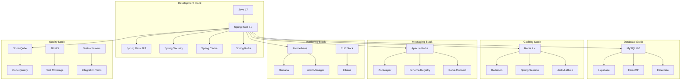

This visual documentation provides comprehensive diagrams and mind maps to help understand the system architecture, data flow, and technology stack of the Online Bookstore application.
